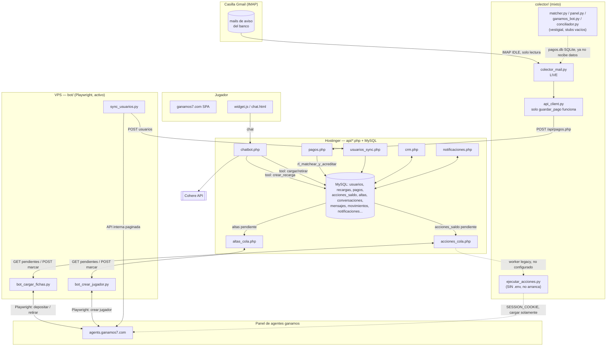

# AUDIT.md — Levantamiento del proyecto GOLDPAW / ganamos

> Fase 1 del plan CRM. Todo lo que sigue está verificado leyendo el código
> (migraciones SQL, PHP, Python, HTML) el 2026-08-16. Donde no pude confirmar
> algo con certeza, lo marco explícitamente como **pendiente confirmar**.
>
> **Aviso importante:** varias cosas que dice `CLAUDE.md` están desactualizadas
> respecto del código real. Las marco en la sección final ("Correcciones a
> CLAUDE.md") para que las tengas presentes — no las estoy inventando, las leí
> directamente en los archivos citados.
>
> **Actualización — Fase 0 (limpieza) aplicada:** `matcher.py`, `panel.py`,
> `ganamos_bot.py`, `ganamos_conciliador.py` y `ejecutar_acciones.py` se
> movieron a `colector/_legacy/` (con su propio README explicando por qué cada
> uno quedó inerte). `colector/api_client.py` **no** se movió — sigue en
> `colector/` porque `colector_mail.py`, que está en producción, lo necesita.
> `colector/config.json`, `colector/pagos.db` y `colector/estrategia.txt` ya
> están en el `.gitignore` de la raíz. `CLAUDE.md` ya tiene las correcciones
> que se listan más abajo. Los hallazgos de esta sección quedan tal como se
> encontraron originalmente (referencian las rutas viejas) porque documentan
> el estado *en el momento de la auditoría* — donde cambió algo por la
> limpieza, lo marco inline.

---

## Resumen ejecutivo (lo más importante primero)

1. **El chatbot está roto ahora mismo**: `api/config.local.php` tiene
   `COHERE_API_KEY => 'REEMPLAZA-ESTO'` (placeholder, nunca se completó).
   `chatbot.php` devuelve 500 hasta que se cargue una key real.
2. **Hay dos generaciones de "worker de saldo" conviviendo en el repo**, y la
   que describe `CLAUDE.md` (`colector/ejecutar_acciones.py`) **no tiene
   `.env`** en `colector/`, o sea que no puede arrancar tal como está el repo.
   La que sí está configurada con credenciales reales es
   `bot/bot_cargar_fichas.py` (Playwright), que además **sí automatiza
   retiros** — contradiciendo lo que dice `CLAUDE.md` sobre que el retiro "no
   está implementado".
3. **`colector/` tenía un pipeline entero legacy** (`matcher.py`, `panel.py`,
   `ganamos_bot.py`, `ganamos_conciliador.py`) que quedó inerte cuando
   `colector/api_client.py` se adaptó para postear directo a `pagos.php`.
   *(Ya archivado en `colector/_legacy/` como parte de la Fase 0 — ver
   actualización arriba.)* Esos cuatro scripts se podían correr, pero no
   hacían lo que su propio docstring decía porque las funciones de las que
   dependen están stubbeadas.
4. **`login.php`, `cola_panel.php`, `jugadores_crud.php` y `diagnostico.php`
   están completamente rotos**: consultan la tabla `jugadores`, que la
   migración 07 borró. Cualquier request les da `SQLSTATE[42S02]: ... doesn't
   exist`. Siguen en el repo, subidos o no al server (pendiente confirmar).
5. **Ya existe un CRM parcialmente construido**: `landing/crm.html` (797
   líneas) tiene exactamente la forma que pediste como referencia — rail
   lateral con Conversaciones/Usuarios/Cargas/Transacciones/Retiros/
   Comprobantes/Push, panel de chat, panel de perfil del jugador con saldo y
   botones de carga. **Sólo el módulo "Conversaciones" está conectado a un
   backend real** (`crm.php`); el resto son botones de navegación sin panel
   implementado. Además existe `landing/admin.html`, una página aparte
   (login con `ADMIN_PASS`) que sí funciona de punta a punta como "Usuarios
   Casino" contra `admin_usuarios.php`.
6. **Credencial real en `colector/config.json:11`** (contraseña de aplicación
   de Gmail en texto plano). *(Ya resuelto en la Fase 0: el archivo está
   agregado al `.gitignore` de la raíz desde antes de inicializar el repo, así
   que nunca llegó a versionarse.)*

---

## 1.1 Base de datos

**Motor:** MySQL/MariaDB (InnoDB), una sola base, en Hostinger — **no acepta
conexiones remotas** (por eso existen las colas `acciones_saldo`/`altas` en
vez de que los bots de Python conecten directo). Confirmado en `api/db.php`
(PDO `mysql:` DSN) y repetido en varios comentarios del código.

Hay además una **segunda base, SQLite, desconectada de la anterior**:
`colector/pagos.db` (crea sus tablas `matcher.py`/`panel.py`: `solicitudes`,
`huellas`, `clientes`, y si corriera `ganamos_conciliador.py`, también
`ganamos_peticiones`/`ganamos_log`). Es el remanente del prototipo viejo del
colector. **Pendiente confirmar:** si ese archivo `.db` existe hoy en el
servidor/VPS y con qué datos — por el código, ya no se le escribe nada nuevo
desde el camino de producción (ver sección 1.2).

### Tablas — estado actual (después de aplicar las 17 migraciones)

| Tabla | Migración | Operativa / Infra | Notas |
|---|---|---|---|
| `jugadores` | 01, **DROP en 07** | — | **No existe más.** Ver "tablas muertas". |
| `usuarios` | 03, alterada en 07 y 17 | Operativa (núcleo) | Ver columnas abajo |
| `recargas` | 02 | Operativa | Pedidos de carga por transferencia |
| `pagos` | 02 | Operativa | Transferencias capturadas del mail |
| `ruleta_jugadas` | 04 | Infra / huérfana | Reemplazada por `ruleta_giros` (06), nunca se borró, ya no se usa |
| `conversaciones` | 05, alterada 08 y 09 | Operativa (CRM) | |
| `mensajes` | 05 | Operativa (CRM) | FK real a `conversaciones` |
| `movimientos` | 05, alterada 09 | Operativa | Historial de fichas/bonos/saldo |
| `ruleta_giros` | 06 | Operativa | Reemplaza a `ruleta_jugadas` |
| `acciones_saldo` | 09, alterada 15 y 16 | Operativa | Cola para el worker de saldo |
| `accesos` | 10 | Operativa | Login propio del sitio |
| `dispositivos` | 11 | Operativa (push) | |
| `notificaciones` | 11, alterada 12 | Operativa (push) | |
| `notificaciones_entregas` | 11 | Infra (dedup de entrega) | PK compuesta |
| `altas` | 13, alterada 14 | Operativa | Reemplaza a la cola vieja sobre `jugadores` |

No hay tabla de control de migraciones (tipo `schema_migrations`): las 17
migraciones son archivos `.sql` numerados que se corren a mano, una vez, sin
registro de cuáles ya se aplicaron. **Pendiente confirmar:** si las 17 están
aplicadas en producción — el código de `usuarios_sync.php` usa columnas de la
17 (`balance_web`), así que si esa migración no corrió, ese endpoint rompe.

### `usuarios` — columnas (la tabla central)

```
id              BIGINT PK        -- id del usuario EN GANAMOS, no autoincrement local
username        VARCHAR(80) UNIQUE
balance         DECIMAL(14,2)    -- saldo REAL, solo lo escribe sync_usuarios.py (+ acciones_cola.php tras confirmar una carga)
bonus           DECIMAL(14,2)    -- bono propio (CRM, ruleta)
total_deposits  DECIMAL(14,2)    -- viene del panel
role, is_banned, creation_date, actualizado_en
coins           BIGINT           -- ficha propia (recargas, CRM)
tiene_app       TINYINT(1)       -- lo escribe notif_registrar_dispositivo() cuando el device es Android
notificaciones  TINYINT(1)       -- idem
ultima_actividad DATETIME        -- columna existe, pendiente confirmar quién la escribe (no encontré ningún UPDATE a esta columna en el código PHP/Python revisado)
balance_web     DECIMAL(14,2)    -- lo escribe saldo_reportar.php (endpoint público, sin key)
balance_web_en  DATETIME
```

Colación: `usuarios` quedó en `utf8mb4_uca1400_*`; las tablas del CRM
(`conversaciones`, `mensajes`, `movimientos`, `ruleta_giros`,
`acciones_saldo`, `accesos`, `dispositivos`, `notificaciones`,
`notificaciones_entregas`) se crearon en `utf8mb4_unicode_ci`. `altas` se dejó
**sin** collation explícita a propósito para heredar el default del server
(que coincide con `usuarios`) y poder comparar `altas.usuario = usuarios.username`
sin `COLLATE`. Cualquier `JOIN` nuevo entre `usuarios` y una tabla CRM sí
necesita `COLLATE` explícito.

### Relaciones

- **FK real (con `REFERENCES`)**: sólo `mensajes.conversacion_id → conversaciones.id` (`ON DELETE CASCADE`).
- Todo el resto son referencias **implícitas por convención de nombre**,
  típicamente una columna `VARCHAR usuario`/`username` que debería matchear
  `usuarios.username`, sin constraint de base de datos: `conversaciones.usuario`,
  `conversaciones.clave`, `movimientos.usuario`, `recargas.usuario`,
  `pagos.recarga_id → recargas.id` (tampoco es FK), `acciones_saldo.usuario`,
  `accesos.usuario`, `dispositivos.usuario`, `notificaciones.usuario`,
  `altas.usuario`, `ruleta_giros.usuario`.
- `usuarios.id` **no es un autoincrement local**: es el `id` que trae el panel
  de ganamos (lo pisa `usuarios_sync.php` con `ON DUPLICATE KEY UPDATE`).

### Tablas muertas / huérfanas

- **`jugadores`** — borrada en la migración 07. Cuatro archivos PHP siguen
  consultándola como si existiera: `login.php`, `cola_panel.php`,
  `jugadores_crud.php`, `diagnostico.php`. Cualquiera de los cuatro rompe con
  un 500/SQL error si se lo llama hoy. **Pendiente confirmar**: si estos
  archivos siguen subidos al hosting o ya se bajaron.
- **`ruleta_jugadas`** — reemplazada por `ruleta_giros` en la migración 06.
  El propio comentario de la migración dice "podés dejar como está". Nadie la
  lee ni la escribe en el código actual.

---

## 1.2 Bots y automatizaciones existentes

Hay **tres generaciones** conviviendo en el repo: la actual (`bot/`, con
Playwright), una intermedia rota (`colector/ejecutar_acciones.py`), y una
vieja vestigial (el resto de `colector/`). Las separo así porque mezclarlas
lleva a conclusiones equivocadas sobre qué está realmente automatizado hoy.

### Generación actual — `bot/` (Playwright, configurada con credenciales reales en `bot/.env`)

| Script | Qué hace | Lee | Escribe | Cada cuánto |
|---|---|---|---|---|
| `bot/bot_crear_jugador.py` | Da de alta jugadores en `agents.ganamos7.com` tipeando el form "Crear jugador" | `altas` (vía `api/altas_cola.php?accion=pendientes`, GET que además reclama las filas) | `altas.estado/mensaje` (vía `?accion=marcar`) | loop cada `POLL_SEGUNDOS` (30s default) o `--once` |
| `bot/sync_usuarios.py` | Espeja TODOS los usuarios + saldo del panel a la base propia | API interna del panel (`agents.ganamos7.com/api/agent_admin/user/`, paginada) | `usuarios` (vía `api/usuarios_sync.php`) | manual o `--loop 300` |
| `bot/bot_cargar_fichas.py` | Ejecuta en el panel las acciones de saldo pendientes: **carga Y retiro** | `acciones_saldo` (vía `api/acciones_cola.php?accion=pendientes`) | `acciones_saldo.estado/saldo_antes/saldo_despues` (vía `?accion=marcar`); indirectamente `usuarios.balance` (lo pisa `acciones_cola.php` con el `saldo_despues` reportado) | loop `FICHAS_POLL_SEGUNDOS` (20s) o encadenado con el de arriba vía `--con-fichas` |

Dependencias entre ellos: los tres **comparten la sesión de Playwright**
(`bot_crear_jugador.nuevo_contexto()`, `estado_sesion.json` /
`estado_session_storage.json`). `sync_usuarios.py` y `bot_cargar_fichas.py`
literalmente hacen `import bot_crear_jugador as bot` y reusan su login y sus
helpers. Correr dos sesiones de agente en simultáneo se pisa entre sí (el
panel tira abajo la sesión vieja), así que en producción conviene correrlos
encadenados con `--con-fichas` en un único proceso.

`bot_cargar_fichas.py` arranca en `FICHAS_MODE=DRY_RUN` (completa el
formulario pero no lo envía) salvo que el `.env` tenga `FICHAS_MODE=LIVE`.
**Pendiente confirmar con vos**: qué valor tiene `FICHAS_MODE` en el `bot/.env`
real del servidor/VPS — no lo leí porque es una credencial/config viva, pero
es la pregunta que define si hoy se está depositando y retirando plata de
verdad o sólo simulando.

### Generación intermedia — `colector/ejecutar_acciones.py` (la que describe `CLAUDE.md`, actualmente no operable)

Lee la misma cola `acciones_saldo` (vía `api/acciones_cola.php`), pero en vez
de Playwright usa la API interna del panel con una `SESSION_COOKIE` pegada a
mano en `colector/.env`. Sólo soporta `tipo == 'cargar'` (aprueba un pedido de
depósito **que el jugador ya haya hecho en el panel**); si la acción es
`'retirar'`, la marca como error explícitamente ("no soportado, aprobalo a
mano"). **No existe `colector/.env`** en este repo — sin `SESSION_COOKIE` el
script no arranca (`if not SESSION_COOKIE: log.error(...); return 1`). Con el
repo tal cual está, este script está inerte.

### Generación vieja — resto de `colector/` (vestigial)

| Script | Qué hacía | Estado real hoy |
|---|---|---|
| `colector/colector_mail.py` | Lee mails IMAP (multi-casilla, solo lectura), parsea el comprobante con regex, filtra por remitente+DKIM, llama `api_client.guardar_pago()` | **Sigue LIVE** — es la única pieza de `colector/` que efectivamente corre en producción. Config real en `colector/config.json` (una casilla Gmail configurada). |
| `colector/api_client.py` | Adaptador hacia la API PHP | Sólo `guardar_pago()` está implementado de verdad (POST a `api/pagos.php`). Las otras siete funciones (`upsert_peticion`, `marcar_pago_usado`, `log`, `guardar_huella`, `cerrar_afuera`, `buscar_pagos`, `get_peticion`) son **stubs** que no tocan ninguna base — están ahí solo para que no rompan los imports de los scripts de abajo. |
| `colector/matcher.py` | Matching por 3 capas (monto exacto / CUIT-CBU / nombre+ventana) sobre SQLite `pagos.db` | **No es el matcher activo.** El matching real de producción vive en `api/recargas_lib.php::rl_matchear_y_acreditar()` (2 capas, corre en MySQL, lo dispara `pagos.php`). `matcher.py` se puede correr por CLI pero nada del flujo real lo invoca. |
| `colector/panel.py` | Dashboard local (`http.server`, sin frameworks) sobre `pagos.db` | Depende de tablas que ya nadie llena (`ganamos_peticiones`, `ganamos_log` — sólo las escribiría `ganamos_conciliador.py`, y ese pasa por los stubs de `api_client.py`). La pestaña "Ganamos" del panel mostraría vacío. La pestaña "Transferencias" también, porque `colector_mail.guardar()` ya no inserta en `pagos.db`, sólo pega a la API. **Pendiente confirmar**: si alguien sigue abriendo este panel — por el código, hoy no tendría datos que mostrar. |
| `colector/ganamos_bot.py` | Aprueba automáticamente CUALQUIER pedido de depósito pendiente y le suma un % de bono fijo (`BONO_PERCENTAGE`, default 20%), **sin verificar transferencia real** | Modos DRY_RUN/SAFE(whitelist)/LIVE. No usa `colector_mail.py` ni ningún matching. Correrlo en LIVE regalaría fichas sin control. |
| `colector/ganamos_conciliador.py` | Superset de `ganamos_bot.py`: antes de aprobar, busca en `pagos.db` una transferencia que respalde el pedido | Como `api_client.buscar_pagos()` es un stub que devuelve `[]` siempre, este conciliador **nunca encuentra respaldo real** con la config actual → todo pedido queda en "esperando"/"revisión", nunca se aprueba solo. Efectivamente inerte. |

`herramientas/generar_logo.py` no es un bot/proceso autónomo — es un script
manual que genera los íconos del APK y la landing a partir de una imagen
fuente. Lo dejo afuera del resto del análisis.

---

## 1.3 Integraciones externas

| Integración | Dónde | Estado |
|---|---|---|
| **Cohere** (`command-r-08-2024`, chat v2 con tool-use) | `api/chatbot.php` | **Sin configurar**: `COHERE_API_KEY` en `api/config.local.php:16` sigue en el placeholder `'REEMPLAZA-ESTO'`. El chatbot devuelve 500 hasta que se cargue una key real. |
| **Panel de agentes ganamos** (`agents.ganamos7.com`) | Playwright (`bot/*.py`) + API interna con cookie (`colector/ganamos_bot.py`, legacy) | Vivo (Playwright) para altas/sync/cargas; la vía cookie está inerte por falta de `.env`. |
| **IMAP** (Gmail) | `colector/colector_mail.py`, config en `colector/config.json` | Vivo. Una sola casilla activa (`nahuelherrera1997@gmail.com`), remitente autorizado `info@mail.tarjetacencosud.com.ar`. |
| Mercado Pago | — | **No existe integración en el código.** Sólo aparece implícitamente como método de cobro (transferencia bancaria genérica, no la API de MP). |
| WhatsApp | — | **No existe.** El chat es propio (widget + `chatbot.php` + CRM), no hay integración con WhatsApp Business API en ningún archivo. |
| Meta Ads | — | **No existe.** Sólo aparece como ítem del rail de navegación en `landing/crm.html` (botón sin panel detrás). |
| Firebase / push de terceros | — | **A propósito, no existe** (documentado extensamente en `CLAUDE.md` y confirmado en código: sistema propio de cola+sondeo). |

### Credenciales encontradas en archivos (marco ubicación, no reproduzco el valor)

- `api/config.local.php:13` — `BOT_API_KEY` real, clave de producción viva.
  Archivo **sí** está en `.gitignore`.
- `colector/config.json:11` — contraseña de aplicación de Gmail en texto
  plano. *(Resuelto en la Fase 0: agregado al `.gitignore` antes de correr
  `git init`, así que nunca se versionó.)*
- `bot/.env` — existe, con credenciales reales (API_URL, API_KEY, PANEL_USER,
  PANEL_PASS todos con valor). Cubierto por la regla genérica `.env` del
  `.gitignore` (esa regla, sin `/` inicial, matchea en cualquier carpeta).
- `.env` (raíz) — existe pero con **todas las claves vacías**: confirma que
  esta ruta legacy no está en uso.
- `colector/.env` — **no existe**. `ejecutar_acciones.py` y
  `ganamos_bot.py`/`ganamos_conciliador.py` no pueden arrancar sin él.

### Módulos de OCR / IMAP / scraping / webhook

- **IMAP**: sí, `colector_mail.py`, sólo lectura (`BODY.PEEK`, nunca marca
  leído ni borra, ni mueve nada).
- **OCR de imagen/PDF**: **no existe**. Lo que se extrae del comprobante
  (monto, CUIT, CBU, remitente, fecha, entidad, nro de transacción) sale de
  **parsear el texto del mail bancario** con expresiones regulares
  (`colector_mail.py::extraer_campos`), no de una imagen. Cuando el jugador
  sube una foto/PDF del comprobante por el chat (`api/subir.php`), ese archivo
  se guarda y se muestra al agente en el CRM, pero **nadie le extrae datos**:
  es sólo un adjunto visual. Esto es relevante para el diseño del CRM: el
  "procesamiento automático de comprobantes con extracción en tiempo real"
  que pediste como referencia hoy sólo pasa con el mail, no con la imagen.
- **Scraping**: sí, pero de la UI del panel de agentes vía Playwright (no es
  "scraping" de terceros, es automatizar el propio panel).
  `bot_cargar_fichas.py` también lee saldos parseando texto libre de la
  pantalla (no hay una API limpia para eso).
  ganamos_bot.py/conciliador sí usan la API interna JSON del panel
  (`agents.ganamos7.com/api/...`) en vez de UI, pero están inertes.
- **Webhook receiver**: no hay uno entrante. `colector_mail.py` tiene un
  webhook **saliente** opcional (`disparar_webhook`, si configurás
  `webhook_url`/`webhook_token` en `config.json`) para avisar a un tercero
  cuando entra un pago — no está en uso por defecto (`webhook_url: ""`).

---

## 1.4 Qué de la lógica de negocio pedida ya existe

| Funcionalidad | Estado | Dónde |
|---|---|---|
| Extracción de datos de comprobante (monto/CUIT/COELSA) | **Parcial** | Sólo desde texto de mail (`colector_mail.py`), regex. No hay OCR de imagen/PDF. |
| Detección de transferencias entrantes | **Sí** | `colector_mail.py`, IMAP IDLE en vivo |
| Matching automático comprobante↔transferencia | **Sí** | `api/recargas_lib.php::rl_matchear_y_acreditar()` (monto exacto por centavos únicos, capa 2 por monto entero+ventana, si no → revisión manual) |
| Aprobación de cargas en la plataforma | **Sí (carga)** | `bot/bot_cargar_fichas.py`, automatiza la UI del panel, verifica saldo antes/después. DRY_RUN por default. |
| Otorgamiento de bonos | **Sí** | CRM (`crm.php: cargar_bono`) y ruleta (`ruleta.php`), van a `usuarios.bonus` (contador propio, no toca ganamos) |
| Retiros | **Parcial / contradice CLAUDE.md** | Se puede *pedir* (`fichas_lib.php::fichas_pedir_retiro`, o `crm.php: retirar_saldo`) y `bot_cargar_fichas.py` **sí** tiene automatización de retiro (`retirar_en_panel()`), pero corre en DRY_RUN salvo `FICHAS_MODE=LIVE`. El otro worker (`ejecutar_acciones.py`) explícitamente NO lo soporta. Ver pregunta en la sección final. |
| Chat con jugadores | **Sí, propio** (no WhatsApp) | `chat.html` + `chatbot.php` + `crm.php` + `mis_mensajes.php` |
| Bot conversacional | **Sí, pero sin key configurada** | Cohere vía `chatbot.php` — ver 1.3 |
| Notificaciones push | **Sí, completo** | Cola + sondeo propio, sin Firebase (`notificaciones_lib.php`, APK `SondeoWorker.kt`) |
| Gestión de leads | **No existe** | Ninguna tabla, endpoint ni UI. Sólo aparecería como ítem de menú deseado. |

### Sobre el CRM que ya existe

`landing/crm.html` (797 líneas) ya tiene la **forma** que pediste como
referencia: rail lateral con iconos para Conversaciones, Usuarios,
Cargas/Recargas, Transacciones, Retiros pendientes, Comprobantes, Push &
Notificaciones; panel central de conversaciones con badges y buscador; panel
de perfil del jugador con saldo, fichas, bonos y botones de carga. **Sólo el
nav-item "Conversaciones" está conectado a un backend real** (`crm.php`,
que sólo expone: `conversaciones`, `conversacion`, `nota`, `estado`,
`cargar_fichas`, `cargar_bono`, `cargar_saldo`/`retirar_saldo`, `responder`,
`notificar`, `fijar`). Los demás botones del rail (`usuarios`, `cargas`,
`transacciones`, `retiros`, `comprobantes`, `push`) están en el HTML/CSS pero
no vi, en el JS de `crm.html`, un panel de contenido ni una llamada a API para
ellos — **pendiente confirmar leyendo el JS completo del archivo** (797
líneas, sólo inspeccioné estructura y endpoints), pero por lo que expone
`crm.php` del lado del servidor, esos módulos no tienen datos para mostrar
aún.

Separado de `crm.html` existe `landing/admin.html`: una página con login
propio (clave `ADMIN_PASS`, no JWT) que sí funciona de punta a punta como
listado de "Usuarios Casino" — pega contra `api/admin_usuarios.php` (listar,
filtrar, ordenar, paginar, exportar CSV). Es funcionalmente lo que pide el
módulo "Usuarios Casino" del modelo de referencia, pero vive en una página
aparte, con su propio login, fuera del shell de `crm.html`.

---

## Diagrama — flujo actual (bot ↔ tabla ↔ servicio externo)



---

## Correcciones a `CLAUDE.md` detectadas en esta auditoría

**Ya aplicadas a `CLAUDE.md` en la Fase 0.** Quedan acá como registro de qué
se corrigió y por qué:

1. **"El retiro todavía no está implementado (se marca error y se aprueba a
   mano)"** — Esto es cierto para `colector/ejecutar_acciones.py` (que
   además no tiene `.env` y no arranca), pero **no** para
   `bot/bot_cargar_fichas.py`, que tiene `retirar_en_panel()` completa
   (busca al jugador, verifica saldo real antes de retirar, escribe el
   monto, confirma, relee el saldo después). Corre en DRY_RUN salvo
   `FICHAS_MODE=LIVE`.
2. **CLAUDE.md no menciona `api/altas_cola.php`, `api/altas_lib.php`,
   `api/crear_cuenta.php` ni la tabla `altas`** — que es el reemplazo real y
   vigente de la cola de altas rota por la migración 07. Tampoco menciona que
   `cola_panel.php` y `jugadores_crud.php` están rotos (consultan `jugadores`).
3. **CLAUDE.md describe `colector/ejecutar_acciones.py` como "el worker" con
   `SESSION_COOKIE`** — en la práctica, el worker que sí está configurado y
   corriendo es `bot/bot_cargar_fichas.py` (Playwright, sin `SESSION_COOKIE`,
   con sesión de navegador grabada).
4. **La carpeta que CLAUDE.md llama `vps/`** (reverse proxy + widget
   inyectable, "armado, SIN desplegar") **se llama `replica/`** en el repo
   actual, y está más completa de lo que describe: incluye
   `docker-compose.yml` con nginx + certbot para TLS automático, no sólo la
   config de nginx.

---

## Preguntas para el usuario — respondidas

Ya contestadas en la ronda de Fase 2/3 (quedan acá como registro):

1. `bot/.env` tiene `FICHAS_MODE=LIVE` — confirmado, `bot/` mueve plata real.
2. Los 4 PHP rotos: no se bajan por mí — doy el procedimiento y los baja el
   usuario por FTP (ver `CRM_DESIGN.md`, Fase 0).
3. `colector/panel.py`: ya no se usa — archivado en `colector/_legacy/`.
4. Las 17 migraciones están todas corridas en producción — confirmado,
   **con una excepción encontrada después**: la migración 10 (`accesos`)
   nunca se aplicó — la tabla no existe. No afecta nada del CRM ni de esta
   auditoría (es el login propio de los jugadores, `auth.php`), pero queda
   pendiente para el futuro. Verificado durante el backup previo a la
   migración 18 de Fase 0.5 (2026-08, ver `CRM_DESIGN.md`).
5. `colector/config.json`: resuelto, agregado al `.gitignore` antes del
   primer commit del repo.
6. `landing/crm.html`: se mantiene y se extiende — es la base del CRM de
   `CRM_DESIGN.md`, no se reemplaza.

---

Con esto termina la Fase 1. Decime si confirmás el diagnóstico (o si querés
que revise algo puntual más a fondo, como el JS completo de `crm.html`) antes
de que arranque con `CRM_DESIGN.md` (Fase 2).
